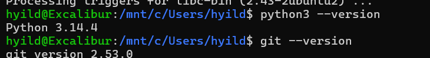
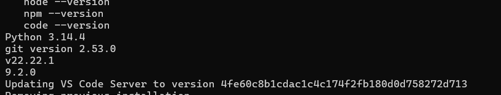

# Kurulum Raporu - Gün 1,2

## Yapılan İşlemler
- WSL2 + Ubuntu kuruldu
- Python 3.14.4 kuruldu
- Git 2.53.0 kuruldu ve yapılandırıldı
- Node.js v22.22.1 ve npm 9.2.0 kuruldu
- SSH key oluşturuldu, GitHub'a bağlandı
- VS Code + WSL entegrasyonu tamamlandı
- dev-journey reposu oluşturuldu, ilk commit push edildi

## Versiyon Doğrulama

